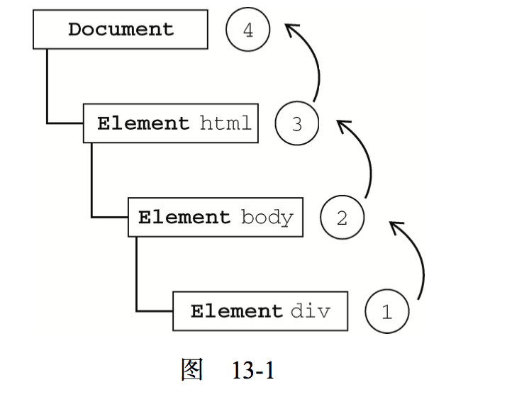
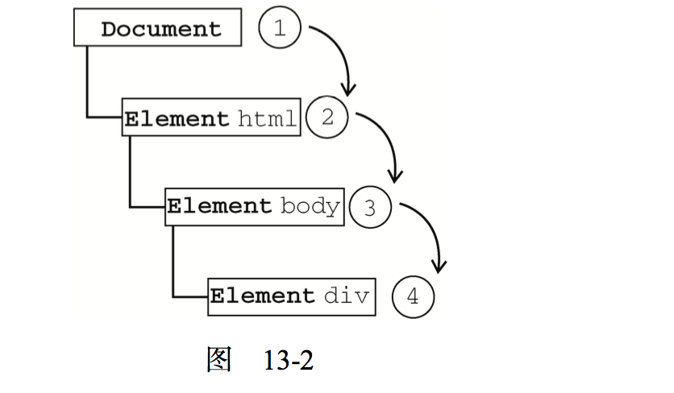
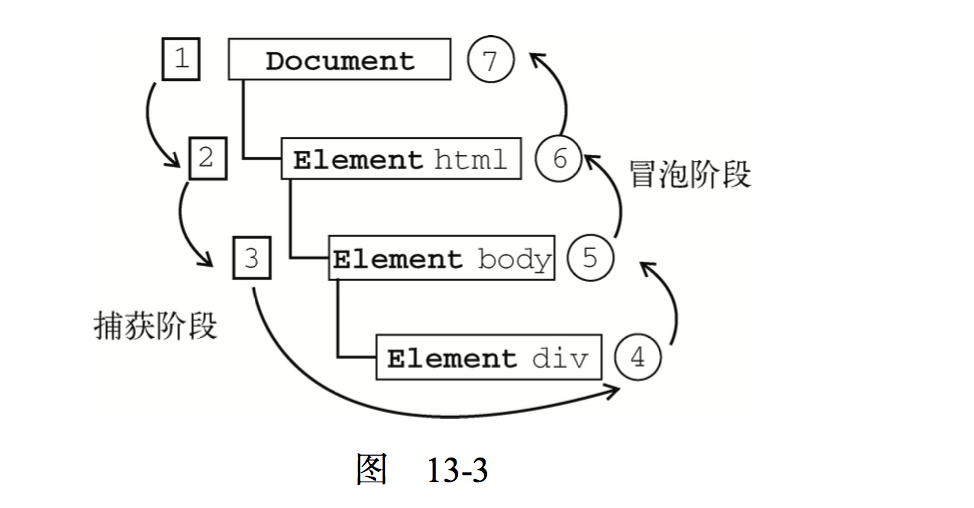
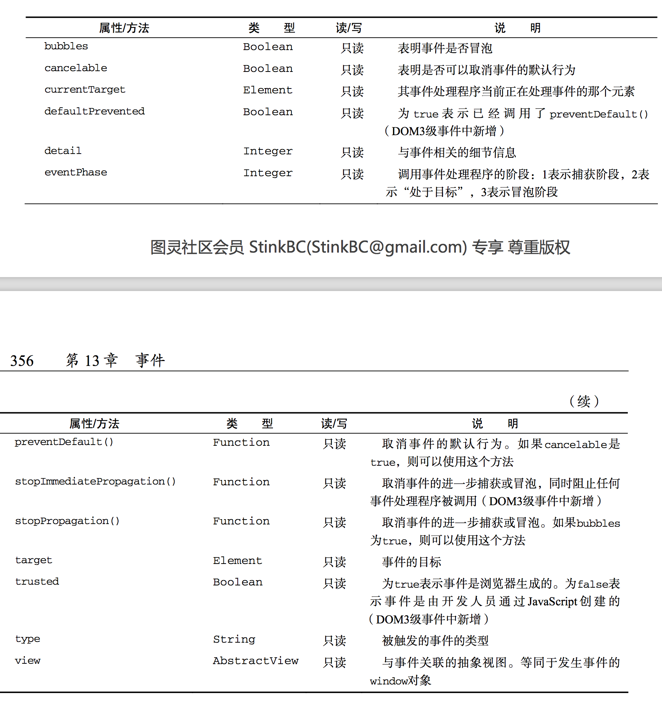
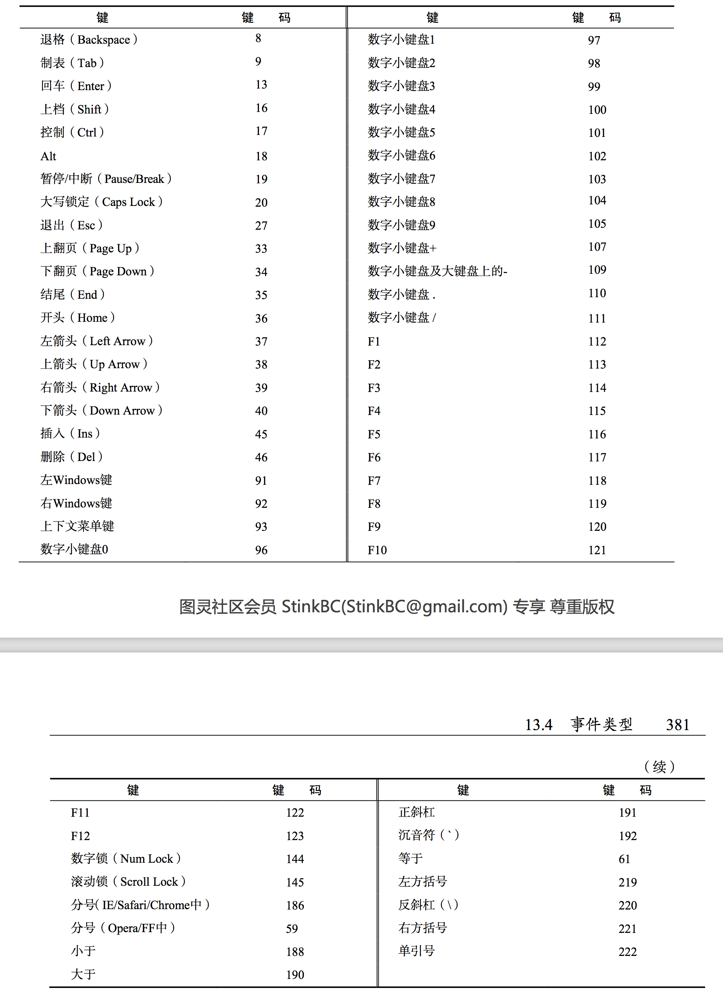

#事件
##事件流
###事件冒泡
这个还是用代码说比较靠谱

```
<!DOCTYPE html>
<html>

<head>
    <title>Event Bubbling Example</title>
</head>

<body>
    <div id="myDiv">Click Me</div>
</body>

</html>
```
可以看到，我们这里有一个myDiv，那么，我在点击它的时候，我的点击事件是会按照下面的这个顺序来传播的

1. \<div>
2. \<body>
3. \<html>
4. document



###事件捕抓
其实也就是一个顺序的问题



###DOM时间流
DOM2级事件规定的时间流包含三个阶段：事件的捕抓阶段、处于目标阶段和事件冒泡阶段。首先发生的是事件捕获，为截取事件提供了机会。然后是实际的目标接收到事件。最后一个阶段是冒泡阶段，可以在这个阶段对事件做出响应。以前面简单的HTML页面为例，单击\<div>元素会按照下图顺序触发



##事件处理程序
###HTML事件处理程序
###DOM2级事件处理程序

一般我们就拿到id，然后id.onxxx来绑定事件

```
var btn = document.getElementById("myBtn");
btn.onclick = function() {
    alert(this.id);
};
```

但是在dom2里面有新的方法,addEventListener，而且可以绑定多次

```
var btn = document.getElementById("myBtn");
btn.addEventListener("click", function() {
    alert(this.id);
}, false);

btn.addEventListener("click", function(){
    alert("Hello world!");
}, false);
```

会按照添加的顺序来触发,而且它必须通过removeEventListener来移除。但是移除的时候也是有技巧的

***下面这样是不行的***

```
var btn = document.getElementById("myBtn");
btn.addEventListener("click", function() {
    alert(this.id);
}, false);
//这里       
btn.removeEventListener("click", function() {
	//不行的！
    alert(this.id);
}, false);
```
我们在使用removeEventListener的时候，第二个参数不许和addEventListener的时候是同一个，上面看起来是一样，但是其实是两个方法，所以我们需要这样

```
var btn = document.getElementById("myBtn");
var handler = function() {
    alert(this.id);
};
btn.addEventListener("click", handler, false);
btn.removeEventListener("click", handler, false);
```
我们做事件绑定的时候还有一种方法

```
var btn = document.getElementById("myBtn");
btn.attachEvent("onclick", function() {
    alert("Clicked");
});
```
看起来是不是和addEventListener差不多，主要区别在于事件处理程序的作用域，在addEventListener的情况下，事件处理程序会在其所属元素的作用域内运行，上面的例子，this就是那个btn,但是在addactEvent里面，事件处理程序会在全局作用域中运行，这里的this等于windis.而且两者还有一个区别，就是对于同一种事件，addEventListener的触发顺序是和绑定顺序一致的，而ddactEvent则是相反，也就是先绑定的后触发

使用attachEvent添加的事件可以通过detachEvent来移除，移除的规则是和addEventListener一样

##事件对象
兼容dom的浏览器会将一个event对象传入到事件处理程序中，无论指定事件处理程序时使用什么方法，都会传入event对象

```
var btn = document.getElementById("myBtn");
btn.onclick = function(event){ 
	alert(event.type); //"click"
};
btn.addEventListener("click", function(event){
	alert(event.type); //"click" 
}, false);
```

不过经过我的测试，传参的时候不一定需要event

```
var btn = document.getElementById("myBtn");
btn.addEventListener("click", function() {
    console.log(event.target);
});
```
而且里面有很多有趣的参数



事件类型

web浏览器中可能发生的事件有很多类型,如前所述,不同的时间类型有不同的信息,而"DOM3级事件"规定了以下几类事件

* UI(User Interface,用户界面事件),当用户与页面上的元素交互时触发
* 焦点事件,单元素获得或失去焦点时触发
* 鼠标事件,当用户通过鼠标在页面上执行操作的时触发
* 滚轮事件,当使用鼠标滚轮(或类似设备)时触发
* 文本事件,当在文档中输入文本时触发
* 键盘事件,当用户通过键盘在页面上执行操作时触发
* 合成事件,当为IME(输入法编辑器)输入字符变化时触发
* 变动(mutation)事件,当底层DOM结构发生变化时触发
* 变动名称事件,当元素或属性名变动时触发.此类事件已经被抛弃,没有任何浏览器实现

为了兼容IE,使用写了一个函数用于事件绑定

```
var EventUtil = {
    addHandler: function(element, type, handler) {
        if (element.addEventListener) {
            element.addEventListener(type, handler, false);
        } else if (element.attachEvent) {
            element.attachEvent("on" + type, handler);
        } else {
            element["on" + type] = handler;
        }
    },
    removeHandler: function(element, type, handler) {
        if (element.removeEventListener) {
            element.removeEventListener(type, handler, false);
        } else if (element.detachEvent) {
            element.detachEvent("on" + type, handler);
        } else {
            element["on" + type] = null;
        }
    },

    getEvent: function(event) {
        return event ? event : window.event;
    },
    getTarget: function(event) {
        return event.target || event.srcElement;
    },
    preventDefault: function(event) {
        if (event.preventDefault) {
            event.preventDefault();
        } else {
            event.returnValue = false;
        }
    },
    stopPropagation: function(event) {
        if (event.stopPropagation) {
            event.stopPropagation();
        } else {
            event.cancelBubbles = true;
        }
    },
    getRelatedTarget: function(event) {
        if (event.relatedTarger) {
            return event.relatedTarget;
        } else if (event.toElement) {
            return event.toElement;
        } else if (event.fromElement) {
            return event.fromElement;
        } else {
            return null;
        }

    }

}
```

###UI事件
ui事件指的是那些不一定与用户操作有关的事情.这些事件在DOM规范出现之前,都是以这种或那种形式存在的

####load事件
JavaScript中最常用的,加载完以后触发

```
EventUtil.addHandler(window, "load", function(event) {
    console.log("加载完毕");
})
```
还可以为页面中的元素添加load,动态添加等

```
 


EventUtil.addHandler(window, "load", function() {
    var image = document.createElement("img");
    EventUtil.addHandler(image,"load",function(event){
        event = EventUtil.getTarget(event);
        console.log("test");
    });
    document.body.appendChild(image);
    console.log("hehe");
    image.src = "70fdea4591e3b55fa29ec2ac9601c99c.gif";

})

```

####unload事件

与load事件对应的是unload事件,这个事件在文档被完全卸载后触发,只要用户从一个页面切换到另外一个页面,就会有unload事件.

但是有个问题,unload是关闭以后的事情了,如果我是希望在关闭前就触发了呢,使用onbeforeunload


```
<script type="text/javascript">
window.onbeforeunload = function() {return 'Sure to leave?';};
</script>
```
这行代码,我发现在chrome中可以,而且对于刷新和关闭页面出来不一样的提示,但是提示都是浏览器自带的
在safari中,刷新和关闭都一样提示关闭
而在FF中直接无用

####resize事件

当浏览器窗口被调整到一个新的高度或者宽度时,就回触发resize事件,这个事件在window(窗口)上触发,因此可以通过JavaScript或者<body>元素中的onresize特性来指定事件处理程序

```
EventUtil.addHandler(window, "resize", function(event){
        alert("Resized");
});
```
####scroll事件
虽然scroll事件是在window对象上发生的,但它实际表示的则是页面中响应元素的变化

```
EventUtil.addHandler(window,"scroll",function(event){
    if (document.compatMode == "CSS1Compat") {
        console.log(document.documentElement.scrollTop);
    } else {
        console.log(document.body.scrollTop);
    }
})
```

###焦点事件

焦点事件会在页面元素获得或者市区焦点时触发.利用这些事件并与document.hasFocus()方法及document.activeElement属性配合.可以知晓用户在页面上的行踪

* blur:在元素失去焦点时触发.这个事件不会冒泡,所有浏览器都支持它
* DOMFocusIn:在元素获得焦点时触发,但是现在已经抛弃它了
* DOMFocusOut:在元素失去焦点时触发.被抛弃了
* focus:在元素获得焦点时触发,不会冒泡
* focusin:和上面是一样的效果,但是会冒泡
* focusout:市区焦点触发和blur一样的效果

###鼠标和滚轮事件
鼠标事件是web开发中最常用的一类事件

* click:单击鼠标或者按下回车触发
* dbclick:双击事件
* mousedown:按下鼠标任何键
* mouseenter:在鼠标光标从元素玩不首次移动到元素范围之内时触发,不冒泡,而且移动到后代元素上也不会触发
* mouseleave:在位于元素上方的鼠标光标移动到元素范围之外时触发,不冒泡,而且移动到后代元素上也不会触发
* mouseover:当鼠标指针在元素内部移动时重复地触发.不能通过键盘触发这个事件
* mouseout:鼠标移开的时候触发
* mouseup:释放鼠标的时候触发

1. 客户区坐标位置,事件触发的时候所在的位置(不加滚动条)
	clientX和clientY
2. 页面坐标位置,事件触发时候鼠标所在的位置(加上滚动条)
	pageX和pageY
	
	所以pageX = clientX + scrollTop;
		pageY = clientY + scrollLeft;


		
```
var div = document.getElementById("myDiv");


EventUtil.addHandler(div,"mouseover",function(event){
    event = EventUtil.getEvent(event);
    var pageX = event.pageX,
        pageY = event.pageY;
    if (pageX === "undefined") {
        pageX = event.clientX + (document.body.scrollLeft || document.documentEleme.scrollLeft);
    }
    if (pageY === 'undefined') {
        pageY = event.clientY + (document.body.scrollTop || document.documentEleme.scrollTop);
    }
    console.log("clientX:"+event.clientX+",clientY:"+event.clientY);
    console.log("pageX:"+event.pageX+",pageY:"+event.pageY);
})
```

给一些没有pageX和pageY属性的浏览器做的一个修复

3. 屏幕坐标位置

就是鼠标事件发生的时候,相对于你的电脑显示屏的位置,event.screenX和event.screenY.


##键盘和文本事件

	keydown,keypress,keyup

1. 键码
	当触发了keydown和keyup的时候,event对象的keyCode里面会包含一个代码,ADSII码,
	
	```
	var textbox = document.getElementById("myText");
	EventUtil.addHandler(textbox, 'keyup', function(event) {
	    event = EventUtil.getEvent(event);
	    console.log(event.keyCode);
	});
	```
	码表
	
	

2. 字符编码

	这个是键盘上面的字符的ASCII码,区分大小写的,也就是大小写不一样
	
	```
	var textbox = document.getElementById("myText");
	EventUtil.addHandler(textbox, 'keypress', function(event) {
	    event = EventUtil.getEvent(event);
	    console.log(EventUtil.getCharCode(event));
	});
	```
3. DOM3的变化
	
	加入了key和char属性,key就是相对于的键盘的key(如'k','D'),按下非字符的时候,key的值是相对的名字("Shift"或"Down"),在chrome和safari,FF里面则是keyIdentifier,但是其实兼容性不是很好,不是很推荐
	还有location属性,也是推荐
	
4. textInput事件
	
	也是在可编辑的地方输入字符就触发,但是和keyxxx等属性不一样的地方是,这个只有可编辑的地方才可以触发,而且只有按下实际字符的时候才触发,也就是退格键之类的不会触发.里面还有一个data的属性,就是你输入的字符
	
	```
	var textBox = document.getElementById('myText');
	EventUtil.addHandler(textBox,"textInput",function(event){
	    var event = EventUtil.getEvent(event);
	    console.log(event.data);
	})
	
	```
	
###变动事件

DOM在变动的时候触发的事件,但是也不是所以的浏览器都会支持

1. 删除节点
	使用removeChild或者replaceChild的时候就会触发这个DOMNodeRemove的事件

2. 插入节点

	在使用appendChild和replaceChild还有insertBefore的时候会先触发这个DOMNodeInserted
	
##HTML5事件

1. contextmenu事件
	
	大概可以理解为右键事件
	
```
EventUtil.addHandler(window,"load",function(event){
    var div = document.getElementById("myDiv");

    EventUtil.addHandler(div,"contextmenu",function(event){
        event = EventUtil.getEvent(event);
        EventUtil.preventDefault(event);

        var menu = document.getElementById("myMenu");
        menu.style.left = event.clientX + "px";
        menu.style.top = event.clientY + 'px';
        menu.style.visibility = "visible";
    })

    EventUtil.addHandler(document,"click",function(event){
        document.getElementById('myMenu').style.visibility = "hidden";
    })
})
```

2. beforeunload

	前面已经介绍过这个事件了
3. DOMContentLoaded事件
	
	window的load事件会在页面中一切加载完毕时触发,而DOMContentLoaded事件则在形成完整的DOM树之后就会触发.不理会图像,js,css文件是否已经下载完毕
	
4. readystatechange

	这个东西一般就用在ajax的时候,每次readyState改变的时候都会触发它

```
function doGet(url) {
    // 注意在传参数值的时候最好使用encodeURI处理一下，以防出现乱码 
    createxmlHttpRequest();
    //用post也是可以的
    xmlHttp.open("GET", url);
    xmlHttp.send(null);
    xmlHttp.onreadystatechange = function() {
        if ((xmlHttp.readyState == 4) && (xmlHttp.status == 200)) {
            alert('success');
        } else {
            alert('fail');
        }
    }
}
```

5. pageshow和pagehide事件

	简单来说,就是我们的页面在前进后退的时候,会把页面的一些信息保留的内存中,这样我们再回到这个页面就不用重新加载某些内容了,这个保留的时候不会很长,但是会影响load事件,load不会被触发,但是pageshow会触发,但是我们要怎么知道它是读了缓存的呢,有一个属性persisted
	
	```
		EventUtil.addHandler(window,'pageshow',function(){
		//true的时候表示从缓存读取
	    console.log(event.persisted);
	})
	```
	还有pagehide事件,和unload相对应的,一样有persisted
	
	```
	EventUtil.addHandler(window, "pagehide", function(event){
	    alert("Hiding. Persisted? " + event.persisted);
	});
	```
	
6. hashchange事件

	其实这个很好理解,就是我的url的参数列表发生了变化,但是这个不会不会有页面的跳转,其实就是在url后面加了#的那一段的变化
	
	```
	EventUtil.addHandler(window, 'hashchange', function() {
   		console.log("旧的URL是" + event.oldURL + ",新的URL是" + event.newURL);
	})
	```
	
##设备事件

1. orientationchange事件
	
	苹果为移动的safari添加的事件,就是横屏事件,在window.orientation属性可能有三个值,0(竖屏),90(home在右侧),-90(home在左侧)

2. MozOrientation事件

	FF3.6添加的事件,Moz是FF专属的,不是标准事件,其实就是陀螺仪事件,有X,Y,Z的值,如果设备向右倾向的话,x值就会减小,类似的,如果设备向远离用户的方向倾斜,y值就会减小,向接近用户的方向倾斜,y值就会增大,z轴检测垂直加速度,1表示静止不动,在设备移动时值会减小(失重状态下值为0),这个是一个实验性的api
	
3. deviveorientation事件

	
4. devicemotion事件

##触摸与手势

1. 触摸事件

	* touchstart:当手指触摸屏幕时触发,即使已经有一个手指放在了屏幕上也会触发
	* touchmove:当手指在屏幕上滑动时连续地触发,这个事件发生期间,调用preventDefault()可以阻止滚动
	* touched:当手指从屏幕上移开时触发
	* touchcancel:当系统停止跟踪时触发.关于此事件的确切触发时间,文档中没有明确说明

	除了常见的DOM属性外,触摸事件还包含下列三个用于跟踪触摸的属性.

	* touches:表示当前跟踪的触摸操作Touch对象的数组
	* targetTouch:特定于事件目标的Touch对象的数组
	* changeTouches:表示自上次触摸以来发生了什么改变的Touch对象数组
	每个Touch都包含下列属性
	
	* clientX:触摸目标在视口中的x坐标
	* clientY:触摸目标在视口中的y坐标
	* identifier:标识触摸的唯一ID
	* pageX:触摸目标在页面中的x坐标
	* pageY:触摸目标在页面中的y坐标
	* target:触摸的DOM节点目标

	```
	//一个简单的例子
	function handleTouchEvent(event) {
	    if (event.touches.length == 1) {
	        var output = document.getElementById("output");
	        switch (event.type) {
	            case "touchstart":
	                output.innerHTML = "点击开始(" + event.touches[0].clientX + "," + event.touches[0].clientY + ")";
	                break;
	            default:
	            case "touchend":
	                output.innerHTML = "<br />点击结束(" + event.changedTouches[0].clientX + "," + event.changedTouches[0].clientY + ")";
	                break;
	            case "touchmove":
	                output.innerHTML = "<br />点击移动(" + event.changedTouches[0].clientX + "," + event.changedTouches[0].clientY + ")";
	                break;
	        }
	    }
	}
	
	EventUtil.addHandler(document,"touchstart",handleTouchEvent);
	EventUtil.addHandler(document,"touchend",handleTouchEvent);
	EventUtil.addHandler(document,"touchmove",handleTouchEvent);
	
	```
2. iOS2.0中的Safari还引入了一组手势事件.当两个手指触摸屏幕时就会产生手势,手势通常会改变显示项

	* gesturestart: 当一个手指已经按在屏幕上而另一个手指又触摸屏幕时触发
	* gesturechange: 当触摸屏幕的任何一个手指的位置发生变化时触发
	* gestureend:当让喝一个手指从屏幕上面移开时触发

	这个是普通的触摸事件不太一样,这个事件必须是两个手指都在一个接收容器里面才可以触发,而且这个事件和touch是有关联的,当一个手指放在屏幕上面的时候,会先触发touchstart事件,如果另外一个手指又放在了屏幕上面,则会先触发gesturestart事件,接下来再触发这只手指的touchstart事件,如果一个或两个手指在屏幕上滑动,将会触发gesturechange事件(这个时候没有触发movestart),但是只要有一个手指移开,就会触发gestureend事件,紧接着又会触发基于该手指的touchend事件
	
	其实总结的来说就是,如果有触摸和手势同时触发的时候,优先触发手势
	
	一个小例子(但是这里gesturestart触发以后gesturechange马上就被触发了)
	
	```
		function handleGestureEvent(event) {
	    var output = document.getElementById("output");
	    output.innerHTML = event.type;
	    switch (event.type) {
	        case "gesturestart":
	            output.innerHTML = "手势开始(" + event.rotation + "," + event.scale + ")";
	            break;
	        case "gestureend":
	            output.innerHTML = "<br />手势结束(" + event.rotation + "," + event.scale + ")";
	            break;
	        case "gesturechange":
	            output.innerHTML = "<br />手势移动(" + event.rotation + "," + event.scale + ")";
	            break;
	    }
	}
	
	document.addEventListener("gesturestart", handleGestureEvent, false);
	document.addEventListener("gestureend", handleGestureEvent, false);
	document.addEventListener("gesturechange", handleGestureEvent, false);
	```

	一个从单指开始.到双指,然后手指移动,最后放开第一个手指,两个手指的触发事件顺序	

	1. 第一根手指放下，触发touchstart
	2. 第二根手指放下，触发gesturestart
	3. 触发第二根手指的touchstart
	4. 立即触发gesturechange
	5. 手指移动，持续触发gesturechange，就像鼠标在屏幕上移动的时候不停触发mousemove一样
	6. 第二根手指提起，触发gestureend，以后将不会再触发gesturechange
	7. 触发第二根手指的touchend
	8. 触发touchstart！注意，多根手指在屏幕上，提起一根，会刷新一次全局touch！重新触发第一根手指touchstart
	9. 提起第一根手指，触发touchend

##内存和性能
就是事件绑定太多,会占用很多内存.
##事件委托和删除

其实就是,我们对于不同的元素有可能都绑定了不同的事件,但是其实不需要全部去绑定,可以用事件委托,在这些元素的父元素那边绑定一个事件,再在里面逻辑处理就可以了,因为很多事件都是冒泡的

```
//这里是html,打一个ul下面有多个li

    <ul id="myLinks">
        <li id="goSomewhere">Go somewhere</li>
        <li id="doSomething">Do something</li>
        <li id="sayHi">Say hi</li>
    </ul>

//这里是js

var list = document.getElementById("myLinks");

EventUtil.addHandler(list, "click", function(event) {
    event = EventUtil.getEvent(event);
    var target = EventUtil.getTarget(event);

    switch (target.id) {
        case "doSomething":
            document.title = "改变标题";
            break;
        case "goSomewhere":
            location.href = "http://www.google.com";
            break;
        case "sayHi":
            console.log("Hi");
            break;
        default:
            // statements_def
            break;
    }

})
```

可以看到,我们只给父元素绑定了一个click方法,但是犹豫click是冒泡的,所以点击它的子元素的时候,这个事件也会被触发,然后我们在里面判断实际的点击的id,做相应的操作,这样,我们就实现了一个事件,做了三个事情,减少了内存的消耗

至于事件的删除,需要注意的是,如果我们直接删除了元素而没有删除事件,这个事件对于内存的占用还是会在的,这样是不合适的

##模拟事件

###DOM中的事件模拟

可以在document对象上使用createEvent()方法创建event对象,这个方法接收一个参数,即表示在创建的事件类型的字符串

* UIEvents:一般化的UI事件.鼠标和键盘事件都是继承与UI事件.在DOM3级中是UIEvent
* MouseEventss:一般化鼠标事件,DOM3级中是MouseEvent
* MutationEvents:一般化的DOM变动事件.DOM3级事件是MutationEvent
* HTMLEvents:一般化的HTML事件,没有对应的DOM3级事件(被分散到其他类别中)

1. 模拟鼠标事件

	```
	var btn = document.getElementById("myBtn");
	
	// 创建事件对象
	var event = document.createEvent("MouseEvent");
	
	// 初始化事件对象(这个方法有15个参数之多,具体的可以查询)
	event.initMouseEvent("click", true, true, document.defaultView, 0, 0, 0, 0, 0, flase, flase, flase, flase, 0, null);
	
	// 触发事件
	btn.dispatchEvent(event);
	```

2. 模拟键盘事件

	在DOM3中才实际存在
	
	```
	var textbox = document.getElementById("textbox"),
    event;
	
	// 以DOM3级方法创建事件对象
	if (document.implementation.hasFeature("KeyboardEvents","3.0")) {
	    event = document.createEvent("KeyboardEvents");
	
	    // 初始化事件对象
	    event.initKeyboardEvent("keydown",true,true,document.defalutView,"a",0,"Shift",0);
	    console.log("!2");
	}
	
	textbox.dispatchEvent(event);
	```
	
3. 模拟其它事件

	虽然鼠标事件和键盘事件是在浏览器中最经常用到的模拟事件,但是有时候同样需要模拟变动事件和HTML事件,
	
	
	```
	var event = document.createEvent("MutationEvents");
	event.initMutationEvent("DOMNodeInserted", true, false, someNode, "","","",0); 
	target.dispatchEvent(event);
	```
	
	
	```
	//focus事件
	var event = document.createEvent("HTMLEvents");
	event.initEvent("focus", true, false);
	target.dispatchEvent(event);
	```
	
	但是其实浏览器中很少用变动事件和HTML事件


4. 自定义DOM事件

	DOM3中还定义了"自定义"事件.自定义事件不是由DOM原生触发的,它的目的是让开发人员创建自己的事件,要创建新的自定义事件,可以调用createEvent("CustomEvent").返回的对象有一个名为initCustomEvent()的方法.接收下面四个参数
	* type(字符串):触发事件的类型,例如"keydown"
	* bubbles(布尔型):表示事件是否改冒泡
	* cancelable(布尔型)表示事件是否可以取消
	* detail(对象):任意值,保存在event对象的detail属性中


	```
	var div = document.getElementById("myDiv"),
    event;

	EventUtil.addHandler(div,"myevent",function(event){
	    console.log("DIV:" + event.detail);
	});
	EventUtil.addHandler(document,"myevent",function(event){
	    console.log("DOCUMENT:" + event.detail);
	});
	
	if (document.implementation.hasFeature("CustomEvents","3.0")) {
	    event = document.createEvent("CustomEvent");
	    event.initCustomEvent("myevent", true, false, "Hello world!");
	    div.dispatchEvent(event);
	}
	```
	
	上面这段代码大概就是我去创建了一个自定义事件绑定到了div和document,然后去触发它div.的这个事件,而且冒泡触发,那么因为div是document的子元素,所以document也一并的被触发了
	
	
###IE中的事件模拟

不理了...

##小结

没什么小结的咯