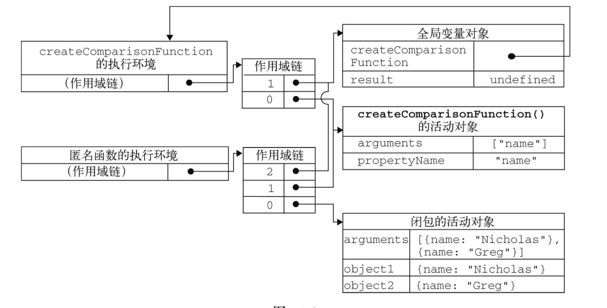

#函数表达式
##递归
简单来说就是函数内部调用函数

```
function factorial(num) {
    if (num <= 1) {
        return 1;
    } else {
        return num * factorial(num - 1);
    }
}
```

##闭包
有权访问另外一个函数作用域中变量的函数。常见的就是在一个函数内部创建另外一个函数。

```

function createComparisonFunction(propertyName) {
    return function(object1, object2) {
        var value1 = object1[propertyName];
        var value2 = object2[propertyName];
        if (value1 < value2) {
            return -1;
        } else if (value1 > value2) {
            return 1;
        } else {
            return 0;
        }
    };
}

var compare = createComparisonFunction("name");

console.log(compare({name:'dong'},{name:'ting'}));//-1

```
在第三第四行里面的propertyName，访问了外部函数的变量propertyName



###作用域链
简单来说，作用域链就是函数在定义的时候创建的，用于寻找使用到的变量的一个索引，而它的内部的规则是，把函数自身的本地变量变量放在了最前面，把自身的父级函数中的变量放在其次，再把高一级函数中的变量放在更后面，以此类推直至全局对象为止。

那么这样的话，当函数需要用到一个变量的时候，js的解析器会去作用域链去查找，从最前面找的本地变量找，如果没有，就到作用链的下一级去找，如果直到最上级(全局变量)的也没有找到，那就返回undefined

###回收机制
一个函数在执行的时候，会给所有其中定义的变量开辟一个内存空间，以备后面的语句使用，等到函数执行完毕返回了，这些在内存中的变量就回被认为没有，这部分的内存就回回收了，下次在执行的时候，就又再开辟一段内存。
但是，如果这个

***函数内部又嵌套了一个函数***

***而这个函数还有可能会被外部调用到***

***并且这个内部的函数还使用了外部函数的变量***

，我们刚才说的那种内存回收机制就会失效了，如果外部函数在返回后，有直接调用了内部函数，那么内部函数就无法读取到它所需要的内部函数中的变量的值了。所以，JS解析器在遇到函数定义的时候，会自动把函数和它可能使用到的变量(包含本地变量父级以及祖先变量(自由变量))一起保存起来，这样就构成了一个闭包，这些变量将不会被内存回收器所回收，只有当内部的函数不可能在被调用以后(例如被删除了或者没有了指针)，才会销毁这个闭包，而没有任何一个闭包引用的变量才会被下一次内存回收启动时所回收。

###闭包和变量


***闭包只能取得包含函数中任何变量的最后一个值***

```
function createFunctions() {
    var result = new Array();
    for (var i = 0; i < 10; i++) {
        result[i] = function() {
            return i;
        };
    }
    return result;
}
var a = createFunctions();
var test1 = a[0]();
var test2 = a[1]();
console.log(test1); //10
console.log(test2); //
```

这里比较奇怪，这个i,我们一直都不知道是什么，有时候它是0、1、2，有时候它固定是10。为什么呢。
我们可以分开来看这个i，第一个就是在定义的时候，这个时候i每一次循环就+1，就从0到9，分别递增，所以我们才可以循环，第二次调用在result[i]这里，这是外部函数的作用域，也是正常的循环，最后一次的return i,这个时候这个i是一个内部的函数，它是闭包里面的外部变量，它只是对于那个变量的一个引用，它的值需要在这个内部函数去执行的时候，再去找这个i的值，那个时候i已经是10了，所以你无论是调用数组里面的哪一个函数，都是return 10;

那么，要如何去解决这个问题呢，看下面这段代码

```
function createFunctions() {
    var result = new Array();
    for (var i = 0; i < 10; i++) {
        result[i] = function(num) {
            return function() {
                return num;
            }
        }(i);
    };
    return result;
}
var a = createFunctions();
var test1 = a[0]();
var test2 = a[1]();
console.log(test1); //0
console.log(test2); //1
```

我们在内部函数里面，再定义了一个匿名函数，把i作为一个实参传过来，那么，在内部函数里面，就没有调用到外部的变量了，这样的话，这个num就会在定义的时候就获得实际的值0~9,并且返回到result[0]~result[9]，结果也印证了我们的猜想

###关于this对象

先来看一个例子

```
var name = "The Window";
var object = {
    name: "My Object",
    getNameFunc: function() {
        return function() {
            return this.name;
        };
    }
};
console.log(object.getNameFunc()());  //The Window;
```

每个函数在被调用时都会自动取得两个特殊变量，this和arguments，这个内部函数在搜索这两个变量的时候，只会搜索到其活动对象为止，因此永远不可能直接访问到外部函数中这两个变量的值。

这里是我的理解，其实我觉得这里就是符合了闭包的三个规则，所以返回的函数这个时候只是一个引用，只有在真正调用的时候再去赋值这个this，那么调用的时候是在window的环境下面了，所以这个this.name就是The Window了

如果要打印这个My Object，可以这样

```
var name = "The Window";
var object = {
    name: "My Object",
    getNameFunc: function() {
        var that = this;
        return function() {
            return that.name;
        };
    }
};
alert(object.getNameFunc()()); //"My Object"
```

在定义内部函数之前，把外部函数的this赋给了that，这个时候外部函数在调用结束以后因为闭包的关系还是在内存中，所以在调用的时候，that还是有的，就是指向object的内部对象，that.name就是My Object;

但是在几中特殊的情况下，this的值可能意外地改变

```
var name = "The Window";
var object = {
    name: "My Object",
    getName: function() {
        return this.name;
    }
};


console.log(object.getName()); //"My Object"
console.log((object.getName)()); //"My Object"
console.log((object.getName = object.getName)()); //"The Window"

```

前面两个都正常，但是第三个为什么是这样的结果，第三行代码先执行了一个赋值语句，但是这个赋值的表达式的值是函数本身，所以this得不到维持？？

###内存泄露

如果闭包的作用域链中保存着一个HTML元素，那么意味着该元素无法被销毁。

```
function assignHandler() {
    var element = document.getElementById("someElement");
    element.onclick = function() {
        alert(element.id);
    };
}
```

这里的这个绑定事件因为对assignHandler里面的活动对象的引用，导致这个对象无法被销毁，内存里面就会一直存在。

```
function assignHandler() {
    var element = document.getElementById("someElement");
    var id = element.id;
    element.onclick = function() {
        alert(id);
    };
    element = null;
}
```

我们这样改造以后，首先放在一个id里面，接着去绑定，里面使用这个id，最后再销毁这个元素，这样就可以保证回回收了。

##块级作用域
首先我们先了解一下什么是块级作用域

***任何一对花括号（｛和｝）中的语句集都属于一个块，在这之中定义的所有变量在代码块外都是不可见的，我们称之为块级作用域。***

但是用var定义的是没有这个说法的

```
function outputNumbers(count) {
    for (var i = 0; i < count; i++) {
        console.log(i);
    }
    console.log(i); //
}
outputNumbers(5);
```
上面这段代码，可以看到，虽然在for循环结束，i并没有销毁，i还是依然有值，这就是非块级作用

那么要如何解决这个问题呢，可以这样

```
(function(){
 
})();

```

这个时候如果你这样

```
function outputNumbers(count) {
    (function() {
        for (var i = 0; i < count; i++) {
            alert(i);
        }
    })();
    alert(i); //        
}

```
这个i是打印不出来的，因为这是一个匿名函数，在匿名函数中定义的变量，都会在执行结束时被销毁

##私有变量
在js中，没有私有成员的概念，但是有私有变量的概念，在任何函数中定义的变量，都可以认为是私有的变量，因为外部是不可以访问得到的。包含函数内部的参数、局部变量和在函数内部定义的其他函数

```
function add(num1,num2){
    var sum = num1 + num2;
    return sum;
}
```
在这个函数内部，有3个私有变量，外部是访问不到的。但是如果在这个函数内部创建一个闭包，那么闭包通过自己的作用域也可以访问到这些变量。我们就可以利用这一点来创建访问私有变量的共用方法，也就是特权方法。

```
function MyObject() {
    // 私有函数
    var privateVariable = 10;

    function privateFunction() {
        return false;
    }

    // 特权方法
    this.publicMethod = function() {
        privateVariable++;
        return privateFunction();
    }
 }
```
 
 
这个模式在构造函数内部定义了所以私有变量和函数，然后又继续创建了能够访问这些私有成员的特权方法。其实就模拟了php的私有方法和公共接口。

 
```
 function Person(name) {
    this.getName = function() {
        return name;
    };
    this.setName = function(value) {
        name = value;
    };
}
var person = new Person("Nicholas");
alert(person.getName()); //"Nicholas"
person.setName("Greg");
alert(person.getName()); //"Greg"
```

##静态私有方法
通过在私有作用域中定义私有变量或函数，同样也可以创建特权方法

```
(function() {
    // 私有变量和私有函数
    var privateVariable = 10;

    function privateFunction() {
        return false;
    }

    // 构造函数
    MyObject = function() {

    };

    MyObject.prototype.publicMethod = function() {
        privateVariable++;
        return privateFunction;
    };
    
})();
```

这个模式创建了一个私有作用域，并在其中封装了一个构造函数及其响应的方法，在私有作用域中，首先定义了私有变量和私有函数，然后又定义了构造函数及其公有方法。公有方法实在原型上定义的，这一点体现了典型的原型模式。

```
(function() {
    var name = "";

    Person = function(value) {
        name = value;
    };

    Person.prototype.getName = function() {
        return name;
    };

    Person.prototype.setName = function(value) {
        name = value;
    }
})();

var person1 = new Person("dong");
console.log(person1.getName()); //dong

person1.setName("ting");
console.log(person1.getName()); //ting
var person2 = new Person("xiao");
console.log(person1.getName()); //xiao
console.log(person2.getName());  //xiao
```
可以看一下这个方法。这里面的getName和setName一样，都可以访问这个私有变量name，在这种模式下面，变量name就变成了一个静态、由所有实例共享的属性，也就是说，这些实例都指向的方法和实例都是同一个，和php的单例模式很相似，就是方法定义为原型方法

这里按照我的理解，因为原型方法都是执行一个地方的，而这个name是一个私有属性，外部是访问不到的，只能通过这个接口去访问，也就实现了一个私有公共的属性的效果

###模块模式
模块模式是为单例创建私有变量和特权方法。一般来说，js是用对象的方法来创建单例的

```
var singleton = {
    name : value ,
    method : function() {
        // 这里是方法的代码
    }
};
```
模块模式通过为单例添加私有变量和特权方法能够十七得到增强

```
var singleton = function() {
    // 私有方法和私有函数
    var privateVariable = 10;

    function privateFunction() {
        return false;
    }

    return {
        publicProperty : true,
        publicMethod : function() {
            privateVariable++;
            return privateFunction();
        }
    }
}
```

这个模块模式使用了一个返回对象的匿名函数，在这个匿名函数内部，首先定义了私有变量和函数，然后，将一个对象字面量作为函数的值返回。这样就可以在外部对内部的私有属性和函数进行操作了。

###增强的模块模式

```
var singleton = function() {
    var privateVariable = 10;

    function privateFunction(){
        return false;
    }

    // 创建对象
    var object = new CustomType();

    // 添加特权/公有属性和方法
    object.publicProperty = true;

    object.publicMethod = function(){
        privateVariable++;
        return privateFunction();
    }

    // 返回这个对象
    return object;
}();
```

这个是什么意思呢，就是在原来的模块模式上面，再添加了一些方法和属性

##小结
* 函数表达式不同于函数声明。函数声明要求有名字，但是表达式不需要，没有名字的函数表达式也叫匿名函数
* 在无法确定如何引用函数的情况下，递归函数就回变得比较复杂
* 递归函数应该始终使用arguments.callee来递归地调用自身，不要使用函数名，因为函数名有可能发生变化

当在内部定义了其他函数的时候，就创建了闭包，闭包有权访问包含函数内部的所以变量，原理如下

* 在后台执行环境中，闭包的作用域链包含着它自己的作用域、包含函数的作用域和全局的作用域
* 通常，函数的作用域及其所有的变量都会在函数执行结束以后销毁
* 但是，当函数返回一个闭包的时候，这个函数的作用域就将会一直在内存中保存到闭包不存在为止
* 创建并立即调用一个函数，这样既可以执行其中的代码，又不会在内存中留下对该函数的引用
* 结果就是函数内部的所有变量都会被立即销毁--除非将某些变量赋值给了包含作用域（即外部作用域）中的变量

闭包还可以用于在对象中创建私有变量，相关概念和要点如下

* 即使JavaScript中没有正式的私有对象的概念，单可以用闭包来实现公用方法，而通过公有方法可以访问包含作用域中定义的变量
* 有权访问私有变量的公有方法叫做特权方法
* 可以使用构造函数模式、原型模式来实现自定义类型的特权方法，也可以使用模块模式、增强的模块模式来实现单例的特权方法