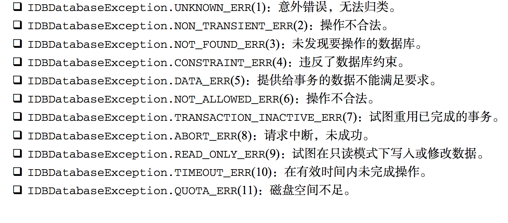

#离线应用与客户端存储
##数据存储
###Cookie

* 构成
	
	* 名称:一个唯一确定cookie的名称.cookie名称是不区分大小写的,所以myCookie和MyCookie被认为是同一个cookie.然而,实践中最好将其区分大小写,因为某些服务会这样处理cookie,cookie的名称必须是经过URL编码的.
	* 值:存储cookie中的字符串值,值必须被URL编码
	* 域:cookie对于哪个域是有效的,所有向该域发送请求中都会包含这个cookie信息,这个值可以包含子域(subdomain,如www.wrox.com),如果没有明确设定,那么这个域会被认作来自设置cookie的那个域
	* 路径:对于指定域中的那个路径,应该 向服务器发送cookie,例如,你可以指定cookie只有从http://www.wrox.com/books/ ,中才能访问,那么http://www.wrox.com 就不会发送cookie信息,即使请求都是来自同一个域的.
	* 失效时间,表示cookie何时应该被删除的时间戳(也就是,何时应该停止向服务器发送这个cookie).默认情况下,浏览器会话结束时即将所有cookie删除,不过也可以自己设置删除时间,这个值是个GMT格式的日期(Wdy, DD-Mon-YYYY HH:MM:SS GMT),用于指定应该删除cookie的准确时间,因此,cookie可在浏览器关闭后依然保存在用户的机器上,如果你设置的失效日期是个以前的时间,则cookie会被立即删除
	* 安全标识:指定后,cookie只有在使用SSL连接的时候才发送到服务器,例如,cookie信息只能发送给https://www.wrox.com,而http://www.wrox.com不能发送cookie.

	每一段信息都作为Set-Cookie头的一部分,使用分号加空格分隔每一段
	
	```
	HTTP/1.1 200 OK
	Content-type: text/html
	Set-Cookie:name=value;expires=Mon, 22-Jan-07 07:10:24 GMT; domain=.wrox.com
	Other-header:other-header-value
	```
	
	该头信息指定了一个叫做name的cookie,它会在格林威治时间2007年1月22日7:10:24失效,同事对于www.wrox.com和wrox.com的任何子域(如p2p.wrox.com)都有效
	
	secure标识是cookie中唯一一个非名值对儿的部分,直接包含一个secure单词.如下:
	
	```
	HTTP/1.1 200 OK
	Content-type: text/html
	Set-Cookie:name=value;domain=.wrox.com;path=/;secure
	Other-header: other-header-value
	```
	
	这里创建了一个对于所有wrox.com的子域和域名下(由path参数指定的)所有页面都有效的cookie,因为设置了secure标识,这个cookie只能通过SSL连接才能传输
	尤其要注意,域,路径,失效时间和secure标志都是服务器给浏览器的指示,以指定合适应该发送cookie.这些参数并不会作为发送到服务器cookie信息的一部分,只有名值对儿才会被发送
	
####JavaScript中的cookie

js中的cookie十分的不好设置,所以写了这个方法

```
var CookieUtil = {

    get: function(name) {
        var cookieName = encodeURIComponent(name) + "=",
            cookieStart = document.cookie.indexOf(cookieName),
            cookieValue = null;

        if (cookieStart > -1) {
            var cookieEnd = document.cookie.indexOf(";", cookieStart);
            if (cookieEnd == -1) {
                cookieEnd = document.cookie.length;
            }
            cookieValue = decodeURIComponent(document.cookie.substring(cookieStart + cookieName.length, cookieEnd));
        }

        return cookieValue;
    },

    set: function(name, value, expires, parth, domain, secure) {
        var cookieText = encodeURIComponent(name) + "=" + encodeURIComponent(value);

        if (expires instanceof Date) {
            cookieText += "; expires=" + expires.toGMTString();
        }

        if (path) {
            cookieText += "; path=" + path;
        }

        if (domain) {
            cookieText += "; domain=" + domain;
        }

        if (secure) {
            cookieText += "; secure";
        }

        document.cookie = cookieText;
    },

    unset: function(name, path, domain, secure) {
        this.set(name, "", new Date(0), path, domain, secure);
    }
};
```

####子cookie

因为一个域名所有的cookie是有限制的,所以有时候我们需要用子cookie的情况

###web存储机制

####IndexedDB

1. 数据库

	* IndexedDB就是一个数据库,和我们用的MySQL类似,IndexedDB最大的特色就是使用对象保存数据,而不是使用表来保存数据,一个IndexedDB数据库,就是一组位于相同命名空间下的对象的集合
	* 使用IndexedDB的第一步就是打开它,即把要打开的数据库名传给indexDB.open(),如果传入的数据库已经存在,就会发送一个打开它的请求,如果传入的数据库还不存在,就会发送一个创建请求并且打开它的请求

	```
	var requset, database;
	request = indexedDB.open("admin");
	request.onerror = function(event) {
	    console.log(event.target.errorCode);
	};
	request.onsuccess = function(event) {
	    database = event.target.result;
	    console.log(database);
	}
	```
	在这两个事件,event.target都指向request对象,因此它们可以互换.如果成功,就在result里面了,如果错误就会在event.target.errorCode里面保存一个错误代码
	
	


	默认情况下,IndexedDB是没有版本号的,但是我在chrome里面看到是有版本号的(1.0)
	
2. 对象存储空间

	数据库建立以后,就是往里面写数据了


***到这里发现这个东西在不同浏览器的区别太大了,不再研究了***


