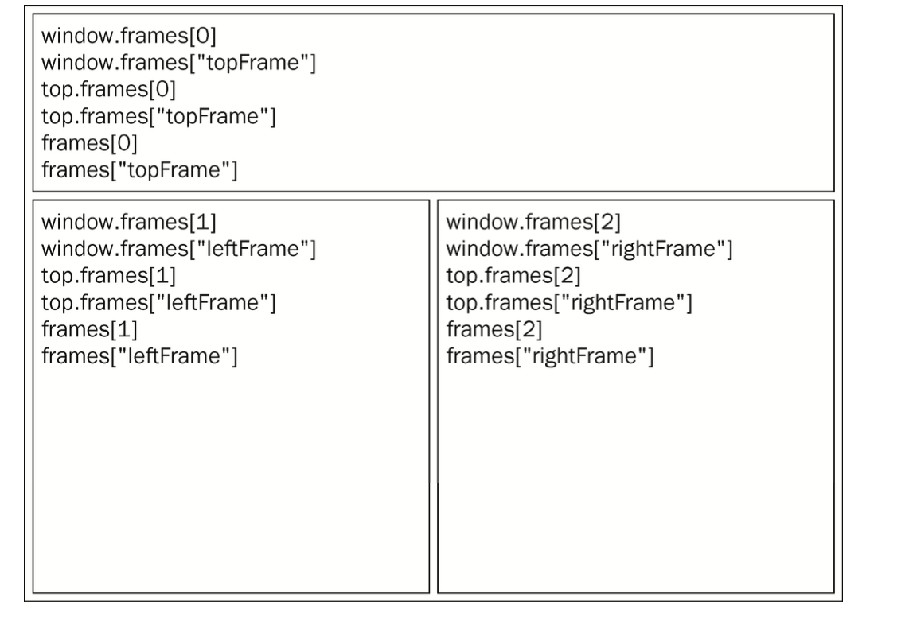
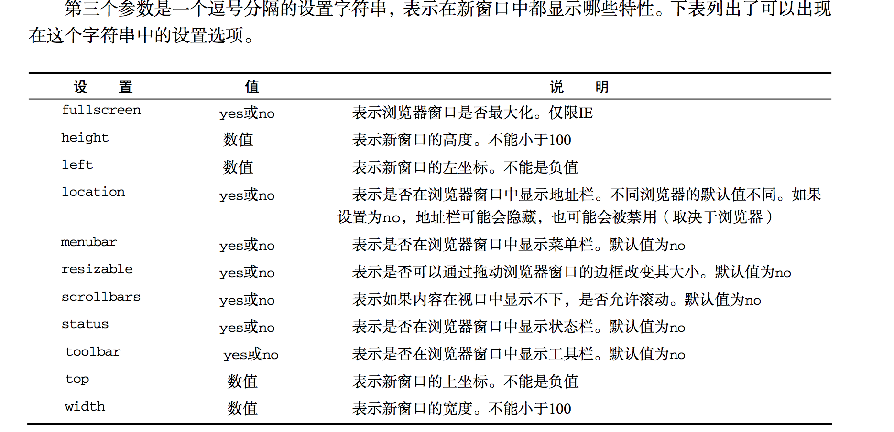
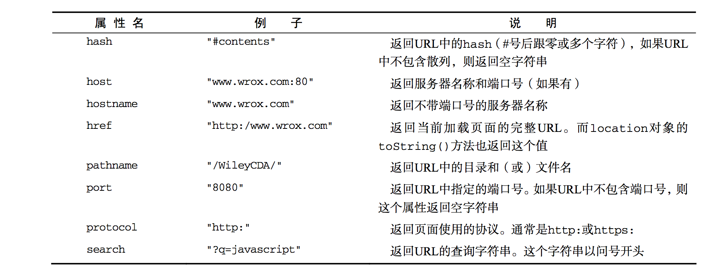

#BOM
BOM其实就是javascript里面的浏览器对象模型，就是不用我们定义就可以在浏览器里面使用的一些对象

##window对象
BOM的核心对象是window，window对象既是ECMAScript规定的global对象。又是window的global对象，所以只有是网页中的对象、变量、函数。都可以访问里面的方法

###全局作用域
我们在全局定义的变量和函数，都会自动成为window的对象

```
var age = 29;
function sayAge(){
    console.log(this.age);
}

console.log(window.age);
sayAge();
window.sayAge();

```

###窗口关系及框架
框架的读取图


###窗口大小
因为各个浏览器之间的不一样，所以确定窗口宽度并不是一件简单的事情

```
var pageWidth = window.innerWidth(),
    pageHeight = window.innerWidth;

if (typeof pageWidth != "number") {
    if (document.compatMode == "CSS1Compat") {
        pageWidth = document.documentElement.clientWdith;
        pageHeight = document.documentElement.clientHeight;
    } else {
        pageWidth = document.body.clientWdith;
        pageHeight = document.body.clientHeight;
    }
}
```
###resizeTo(),resizeBy()

//调整到100X100
window.resizeTo(100, 100);

```
window.open("http://www.wrox.com/", "topFrame");
//约等于< a href="http://www.wrox.com" target="topFrame"></a>
```
点击了这个url，如果有一个名为topFrame的窗口或框架，就会在该窗口或框架加载这个url，否则，就新建一个新窗口将其命名为topFrame。

1. 弹出窗口

	如果给window.open传递的第二个参数并不是一个已经存在的窗口或者框架，那么该方法就会根据第三个参数位置上传入的字符串创建一个新窗口或新标签
	

2. 安全限制
	
	因为有些网站各种恶意弹窗，现在的弹窗一般会询问用户的意见
3. 弹出窗口屏蔽程序

	大多数浏览器有内置的弹出窗口屏蔽程序，如果没有，也可以通过插件来实现，可以这样来检测
	
```
var blocked = false;

try {
    var baidu = window.open("http://www.baidu.com","_blank");
    if (baidu == null) {
        blocked = true;
    }
} catch (ex) {
    blocked = true;
}

if (blocked) {
    console.log("无法弹出！");
}
```
###间歇调用和超时调用
JavaScript是单线程语言，但它允许超过设置超时值来调度代码在特定的时刻执行

####setTimeout
设置一段时间以后执行，不建议第一个参数用字符串

```
<!--1秒以后打印hehe-->
setTimeout(function(){
    console.log('hehe');
},1000);
```
这个函数是有一点局限性的，怎么说呢，因为js是单线程的，在执行一个线程的时候无法执行其他线程，那么如果我设置了某个时间去执行某个工作，但是这个时候js还有其他工作正在执行，那么这个时候，还有需要等待这个工作执行完毕才可以，这就导致有可能设置的时间不准确

还有这个函数会有一个返回值，是一个数值ID，在这个任务未执行之前如果我们需要从执行队列里面把它取消掉，就可以这样

```
var timeoutId = setTimeout(function(){
    console.log("hehe");
},1000);
<!--取消掉-->
clearTimeout(timeoutId);
```

####setInterval
间歇调用与超时调用类似，只不过他会按照指定时间间隔重复执行代码，直至间歇调用被取消或者页面被卸载

```
var num = 0;
var max = 10;
var intervalId = null;

function incrementNumber() {
    num++;

    // 如果执行到了Max就取消掉
    if (num == max) {
        clearInterval(intervalId);
        console.log("Done");
    }
}

intervalId = setInterval(incrementNumber,500);

```
上面这个例子就是设置了一个函数，0.5S执行一次，没执行一次num加1，直到num=max(10)的时候停止,这个逻辑我们也可以用setTimeout来实现

```
var num = 0;
var max = 10;
var intervalId = null;

function incrementNumber() {
    num++;

    // 如果执行到了Max就取消掉
    if (num == max) {
        console.log("Done");
    } else {
        setTimeout(incrementNumber,500);
    }
}

intervalId = setTimeout(incrementNumber,500);

```


##localhost对象

localhost是最有用的BOM对象之一，而且它是和window同级的，所以说wondow.location和document.location是一个对象



###查询字符串参数

就是写了一个函数，实现了一个php里面的parse_url的功能

```
function getQueryStringArgs() {
    // 取得查询字符串并去掉开头的问号
    var qs = (localtion.search.length > 0 ? location.search.substring(1) : ""),
        // 保存数据的对象
        args = {},
        // 取得每一项
        items = qs.length ? qs.split("&") : [],
        item = null,
        name = null,
        value = null,
        // 在for循环中使用
        i = 0,
        len = items.length;

    for (var i = 0; i < len; i++) {
        item = items[i].split("=");
        name = decodeURIComponent(item[0]);
        value = decodeURIComponent(item[1]);
        if (name.length) {
            args[name] = value;
        }
    }

    return args;
}
```

####位置操作
更改location的属性

```
// 假设初始URL为http://www.wrox.com/WileyCDA/
// 修改为http://www.wrox.com/WileyCDA/#section1
location.hash = "#section1";

// 改为http://www.wrox.com/WileyCDA/?q=javascript
location.search = "?q=javascript";
// 改为http://www.baidu.com/WileyCDA/
location.hostname = "www.baidu.com";
// 改为http://www.wrox.com/WileyCDA/mydir
location.path = "mydir";
// 改为http://www.wrox.com:8080/WileyCDA/mydir
location.port = "8080";
```

上面的这些方式都会在浏览器里面生成历史，也就是说可以通过back回去，如果我们不想让用户back回去的话，可以用这种方式

```
location.replace("http://www.baidu.com");
```
##navigator对象
可以用来识别浏览器

```
var explorer = navigator.userAgent;
//ie 
if (explorer.indexOf("MSIE") >= 0) {
    alert("ie");
}
//firefox 
else if (explorer.indexOf("Firefox") >= 0) {
    alert("Firefox");
}
//Chrome
else if (explorer.indexOf("Chrome") >= 0) {
    alert("Chrome");
}
//Opera
else if (explorer.indexOf("Opera") >= 0) {
    alert("Opera");
}
//Safari
else if (explorer.indexOf("Safari") >= 0) {
    alert("Safari");
}
//Netscape
else if (explorer.indexOf("Netscape") >= 0) {
    alert('Netscape');
}
```
##histroy对象

```
// 后退一页
history.go(-1);
// 前进一页
history.go(1);
// 前进两页
history.go(2);

// 跳转到最近的wrox.com
history.go("wrox.com");

// 后退一页
history.go(-1);
// 前进一页
history.go(1);
// 前进两页
history.go(2);

// 跳转到最近的wrox.com
history.go("wrox.com");

// 后退一页
history.back();

// 前进一页
history.forward();

if (history.length == 0) {
	// 这里就是第一个页面
}
```
##小结
* 在使用框架时，每个框架都有自己的window对象已经所以原生构造函数及其他函数的副本。每个框架都保存在frames中集合中，可以通过位置或通过名称来访问
* 有一些窗口指针，可以用来引用其它框架，包含父框架
* top对象始终执行最外围的框架，也就是整个浏览器窗口
* parent对象表示包含当前框架的框架。而self对象则指回window
* 使用location对象可以通过编程方式来访问浏览器的导航系统。设置相应的属性，可以逐段或整体性地修改浏览器的URL
* 调用replace()方法可以导航到一个新URL，同时该URL会替换浏览器历史记录中当前显示的页面

