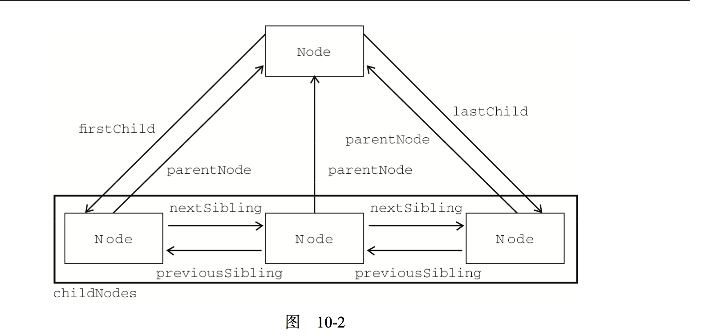

#DOM
针对HRML和XML文档的一个API。其实就是节点树
##节点层次
DOM可以将任何的HTML或XML文档描绘成一个由多层节点构成的结构。节点分为几种不同的类型，每种类型分别表示文档中不同的信息及(或)标记。每个节点都拥有各自的特定、数据和方法，另外也与其他节点存在某种关系。

每一个标记都可以通过树中的一个节点来表示，HTML元素通过元素节点表示，特效(attribute)通过特性节点表示，

###Node类型

首先要理解node这个东西，其实就是标签里面的内容，我是这么简单理解的，然后它有一系列的属性和方法


```
<!--这些是属性-->
nodeType：显示节点的类型  
nodeName：显示节点的名称  
nodeValue：显示节点的值  
attributes：获取一个属性节点,是一个对象，里面也有很多属性
firstChild：表示某一节点的第一个节点  
lastChild：表示某一节点的最后一个子节点  
childNodes：表示所在节点的所有子节点  
parentNode：表示所在节点的父节点  
nextSibling：紧挨着当前节点的下一个节点  
previousSibling：紧挨着当前节点的上一个节点
```
他们的关系可以用这个图来表示



当然还有一系列的方法

```

<body>
    <div id="table"><span name="12">1</span><span>2</span></div>
</body>

</html>
<script>
var nodes = document.getElementById("table");
var firstNode = nodes.firstChild;
var newNode = nodes.appendChild(firstNode);
console.log(newNode);
// var arr = Array.prototype.slice.call(nodes, 0);
</script>
```

上面的代码，有一段html，整个table是一个大的div里面有两个span，我们拿到第一个span，然后给nodes整个appendChild进去，我们发现，span1和span2调转了。其实我们对于节点的操作，是把一个节点给移动了，而不是复制然后粘贴，这个很关键。

```
returnNode = someNode.insertBefore(newNode,null);
console.log(newNode == someNode.lastChild);  //true

// 放到第一个
var returnNode = someNode.insertBefore(newNode,someNode.firstChild);
console.log(returnNode == newNode); //true
console.log(returnNode == someNode.firstChild); //true

// 放到最后一个节点前面
var returnNode = someNode.insertBefore(newNode, someNode.lastChild);
console.log(newNode == someNode.childNodes[someNode.childNodes.length-2]); //true

```
还有放在特定的地方，而不是在最后，可以使用insertBefore，这个函数有两个参数，第一个就是你需要插入的节点，第二个就是参照，也就是要在哪个参照节点前面，如果第二个为null，就插入到最后，和appendChild一样的效果

***上面这两个方法都返回操作的节点***

接下来这个方法，不止移动节点，还可以删除节点

replaceChide方法有两个参数，要插入的节点和要替换的节点。要替换的节点将由这个方法返回并从文档中移除，同事由要插入的节点占据其位置

```

// 替换第一个子节点
var returnNode = someNode.replaceChild(newNode, someNode.firstChild);

// 替换最后一个子节点
var returnNode = someNode.replaceChild(newNode, someNode.lastChild);
```

还有removeChild方法，接受一个参数，就是要移走的节点，并且返回这个节点

```
// 移除第一个子节点
var formerFirstChild = someNode.removeChild(someNode.firstChild);

// 移除最后一个子节点
var formerLastChild = someNode.removeChild(someNode.LastChild);
```

上面这几个操作节点的方法都需要先获取父节点才可以操作，这里是需要注意的。

还有两个所有节点都有的方法

cloneNode,这个方法可以复制当前节点，可以传一个参数，当参数为true的时候，执行深度复制，也就是包含子节点也一并复制了，如果参数为false的时候，只是复制节点本身，无视子节点。复制以后的节点是属于文档所有，但是并没有为其指定父节点，除非用那些appendChild、insertBefore、replaceChild来操作，要不是看不到的

```
<body>
    <ul id="a">
    	<li>item 1</li>
    	<li>item 2</li>
    	<li>item 3</li>
    </ul>
    <div id="b"></div>
</body>

</html>
<script>
var a = document.getElementById('a')
var b = document.getElementById('b');
var cloneNode = a.cloneNode(true);
b.appendChild(cloneNode);
</script>
```
在做节点操作的时候，我们有一个地方必须要注意的，就是空格和回车换行对我们的节点操作是有影响的，它会被认为是一个text文字节点

```
<body>
    <ul id="a">
    	<li>item 1</li>
    	<li>item 2</li>
    	<li>item 3</li>
    </ul>
</body>

</html>
<script>
var a = document.getElementById('a');
console.log(a.firstChild); //text
</script>
```
打印出来的不是第一个li而是text节点


###Document类型
####文档的子节点

文档有两个内置访问其子节点的快捷方法，第一个就是documentElement,这个方法就是拿到<html></html>里面全部的内容,另外一个就是通过childNode来访问，但是如果第一个节点不是html标签的话就比较麻烦，所以还是建议直接用documentElement

```
<html xmlns="http://www.w3.org/1999/xhtml" xml:lang="en">

<head>
    <meta http-equiv="Content-Type" content="text/html;charset=UTF-8" />
    <title>Document</title>
</head>

<body>
    <ul id="a">
    	<li>item 1</li>
    	<li>item 2</li>
    	<li>item 3</li>
    </ul>
</body>

</html>
<script>
var html = document.documentElement;
console.log(html);
console.log(document.childNodes[0]);
</script>
```
还有一些什么document.body之类的

####文档信息

```
// 取得文档标题
var title = document.title;

// 设置文档标题
document.title = "新的标题";
```

下面这三个属性和页面的请求有关系，URL、domain、deferrer

URL属性包含页面完整的URL，domain属性只包含页面的域名。而referrer(介绍人)属性则保存链接到当前页面的那个页面的URL，其实这些属性都是在http头里面的。

####查找元素

其实就是

```
document.getElementById()
document.getElementsByTagName()
document.getElementsByName()
```
不过有还有一个比较有趣的属性nameItem()，使用这个方法可以通过元素的name特性取得集合中的项

```
<body>


</body>

</html>
<script>
// 取得页面里面的所有img
var images = document.getElementsByTagName("img");

var myImags = images.namedItem("1");
console.log(myImags);  //
</script>
```
有时候还会有点小技巧

```
// 取得页面里面的所有img
var allElements = document.getElementsByTagName("*");
```
还有一下特殊集合

```
// 文档中全部带有name的<a>
document.anchors;
// 所有form元素
document.forms;
// 所有img元素
document.images;
// 所有带有href特性的<a>元素
document.links;
```
####文档写入

```
<body>
<p>现在的时间是</p>
<script type="text/javascript">
	document.write("<strong>" + (new Date()).toString() + "</strong>")
</script>
</body>

</html>

```

####Element类型

```
var div = document.getElementById('myDiv');
console.log(div.tagName);
console.log(div.tagName == div.nodeName);
```

html元素

```
var div = document.getElementById("myDiv");
alert(div.getAttribute("id"));  //"myDiv"
alert(div.getAttribute("class"));  //"bd"
alert(div.getAttribute("title"));  //"Body text"
alert(div.getAttribute("lang"));  //"en"
alert(div.getAttribute("dir"));  //"ltr"

```

attributes

```

getNamedItem(name) //返回nodeName属性等于name的节点
removeNamedItem(name) //从列表中移除nodeName属性等于name的节点
setNamedItem(name) //向列表中添加节点，以节点的nodeName属性未索引
item(pos) //返回位于数字pos位置处的节点

var id = element.attributes.getNamedItem("id").nodeValue;
var id = element.attributes["id"].nodeValue;
element.attributes["id"].nodeValue = "someOtherId";
```

####text类型

* nodeType的值为3
* nodeName的值未"#text"
* nodeValue的值为节点包含的文本
* parentNode是一个Element
* 不支持(没有)子节点
	
	可以通过nodeValue属性或者data属性访问Text节点中包含的文本，这两个属性中包含的值相同，对nodeValue的修改也会通过data反映出来
* appendData(text) 将text添加到节点的末尾
* deleteData(offset,count) 从offset指定位置开始删除count个字符(支持中文)
* insertData(offset,count) 从offset指定位置开始插入count个字符(支持中文)
* replaceData(offset,count,text) 用text替换从offset指定位置开始到offset+count为止的文本
* splitText(offset) 从offset指定的位置将当前文本节点分开成两个文本节点，但是只是返回后面的
* substringData(offset,count) 提取从offset知道的位置开始到offset+count为止处的字符串

####创建文本节点

```
var element = document.createElement("div");
element.className = "message";

var textNode = document.createTextNode("hello world");
element.appendChild(textNode);

document.body.appendChild(element);
```

一般来说，每个元素只有一个文本子节点，不过，在某些情况下也可能包含多个文本子节点

```

var element = document.createElement("div");
element.className = "message";
element.id = "message";

var textNode = document.createTextNode("hello world");
element.appendChild(textNode);

var anotherTextNode = document.createTextNode("Yippee!");
element.appendChild(anotherTextNode);

document.body.appendChild(element);

console.log(document.getElementById('message').childNodes); //两个节点
```

但是这样就很奇怪了，因为两个文本其实在一起的，所以我们一般这样处理一下

```

//接上面的代码

element.normalize();
console.log(document.getElementById('message').childNodes);  //这个时候只有一个节点了
```
####分割文本节点

```
var element = document.createElement("div");
element.className = "message";
element.id = "message";

var textNode = document.createTextNode("hello world");
element.appendChild(textNode);

document.body.appendChild(element);

// 从下标为5的位置截取为两个文本节点
var newNode = element.firstChild.splitText(5);
console.log(element.firstChild.nodeValue);  //hello
console.log(newNode.nodeValue);  //world
console.log(element.childNodes.length); //2
```


