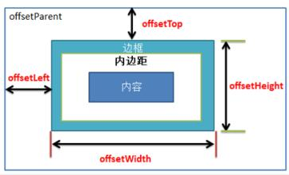
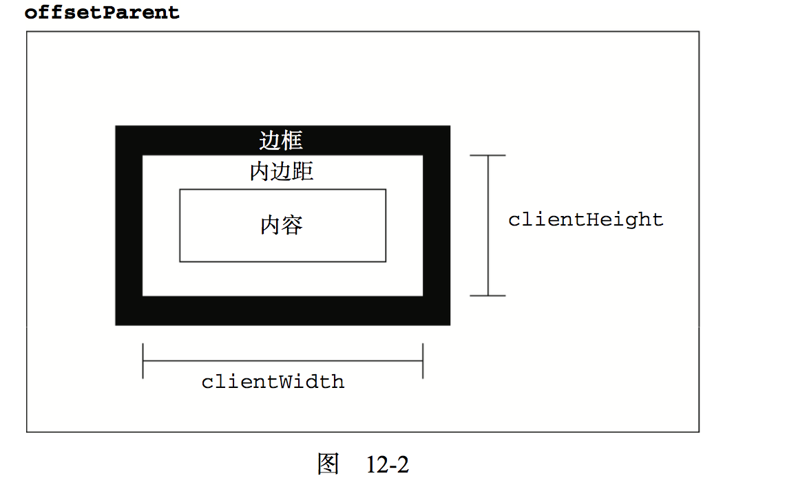

#DOM2和DOM3
###元素大小
1. 偏移量
	* offsetHeight：元素在垂直方向向上占用的空间的大小，以像素计算。包括元素的高度、（可见的）水平滚动条的高度、上边框高度和下边框高度 
	* offsetWidth: 元素在水平方向上占用的空间的大小,以像素计算，包括像素的高度、（可见的）垂直滚动条的宽度、左边框宽度和右边框宽度
	* offsetLeft: 元素左外边框值包含元素左内边框之间的像素距离
	* offsetTop: 元素上外边框至包含元素的上内边框之间的像素距离

一图胜千言

2. 客户区大小
	元素的客户区大小。指的是元素及其内边距所占据的空间大小，有关客户区大小的属性有两个clientWidth和clientHeight
	
3. 滚动大小
	* scrollHeight:在没有滚动条的情况下，元素内容的总高度
	* scrollWidth:在没有滚动条的情况下，元素内容的总高度
	* scrollLeft:被隐藏在内容区左侧的像素数。通过设置这个属性可以改变元素的滚动位置
	* scrollTop:被隐藏在内容区域上方的像素数，通过设置这个属性可以改变元素的滚动位置
	