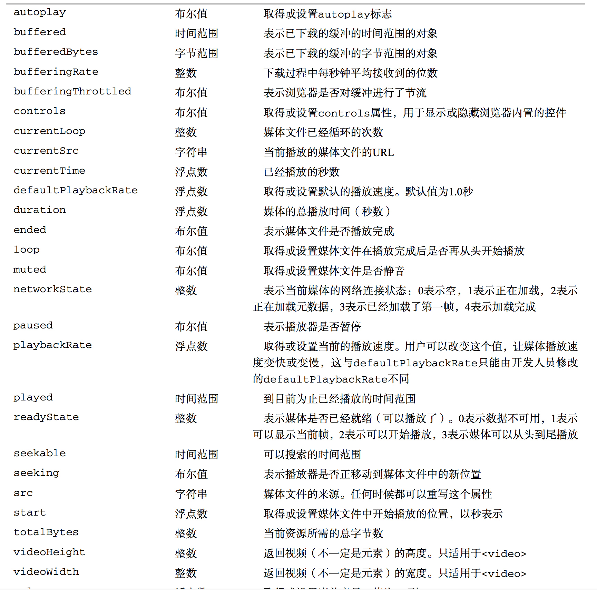
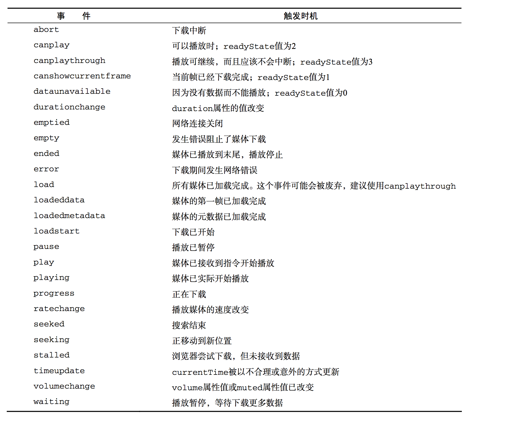

#HTML5脚本编程
##跨文档消息传递

有时候简称为XDM,指的是在来自不同域的页面间传递消息,例如,www.wrox.com域中的页面与位于一个内嵌框架中的p2p.wrox.com域中的页面通讯.在XDM机制出现之前,很麻烦.
postMessage()

这个有点像socket通讯,就是两个不同的页面直接进行通讯,下面做了dome

```
http://localhost/test/index.html 页面

<!--HTML代码-->

<html xmlns="http://www.w3.org/1999/xhtml" xml:lang="en">

<head>
   
</head>
<style>
</style>

<body>
    <div style="width:200px; float:left; margin-right:200px;border:solid 1px #333;">
        <div id="color">Frame Color</div>
    </div>
    <div>
        <iframe id="child" src="http://localhost/test/test.html"></iframe>
    </div>
    </body>
</html>
```

首先在一个html的页面里面嵌套了一个iframe,这就有了两个页面,然后在第一个页面index.html里面写js
这个是什么意思呢,就是,向里面的iframs发动一段信息,信息的内容是getcolor,信息的来源是http://localhost/

```
window.frames[0].postMessage('信息', 'http://localhost/');

```
那么在这个iframe(test.html)里面的js是这样写的,监听messgae事件,然后如果接收到来之localhots的信息,就向信息的发送来源发过去一段信息,内容为收到咯

```

EventUtil.addHandler(window, "message", function(e) {
    console.log(e.data);
    console.log(e.source);
    console.log(e.origin);
    if (e.origin == "http://localhost") {
        alert("收到咯");
        e.source.postMessage("收到咯", "http://localhost");
    }
})

```

那么我们来说一下这个监听事件,这个message的监听事件,有一个回调的参数,里面有一些数据

* e.data 发动过来的数据,在这里是信息
* e.source 发送消息的窗口对象
* e.origin 发送消息窗口的源（协议+主机+端口号）.这里是http://localhost


```
最后我们我们的index.html也会收到一个信息

同样可以监听

    EventUtil.addHandler(window, "message", function(e) {
        // if (e.source) {}
        // alert('12');
        if (e.origin == "http://localhost") {
            // processMessage(e.data);

            alert('收到就好');
        }
    })
```    

##原生拖放
###拖放事件

* dragstart
* drag
* dragend

按下鼠标并开始移动的时候就会触发dragstart事件,此时光标变成"不能放"符号,拖动开始可以通过ondragstart事件处理程序来运行JavaScript代码.dragstart以后就会持续触发drag,和mousemove相似,当拖动结束以后,就会触发dragend事件

单某个元素被拖动到一个有效的放置目标上时,下列事件会依次发生

* dragenter
* dragover
* gragleave或drop

只有元素被拖动到放置目标上,就会触发dragenter,紧随其后的是dragover事件,而且被拖动元素还在放置目标的范围内移动时,就会持续触发该事件,如果元素被拖出了放置目标,dragover就不再发生,但会触发dragleave事件,如果元素被放到了目标中,就会触发drop事件而不是dragleave.

###dataTransfer对象

只有原生的拖放而没有数据变化是没有什么用的,为了在拖放操作时实现数据交换,所以就有了这个dataTransfer,里面有两个方法,getData()和setData()


关于这两个类型,拖动对象(下面简称为A)和放置对象(下面简称为B),都有一些需要注意的地方

* 首先是A,不是所有的dom都是原生允许拖动的,图像,链接和文本,其它的基本都不行,那么如果我要拖动怎么办呢,设置它的draggable属性

```
<div draggable="true">
	我可以被拖动
</div>
```
* 在处理A的拖动的时候,我们可以获取拖动对象的一些属性,通过dataTransfer.getData,但是会有一个问题,就是这个A如果是图片,获取url是没问题,如果不是图片,我们要获取dataTransfer.getData('text'),是要先设置的,也就是说,我们必须先e.dataTransfer.setData('text',"hehe"),但是只能是文本,那么后面,你就可以通过e.dataTransfer.getData('text')来获取到了

```
EventUtil.addHandler(ul1, "dragstart", function(e) {
    // e.dataTransfer.setData('text',"hehe");
    console.log(e.dataTransfer.getData('text'));
    console.log(e.dataTransfer.getData('url'));
    return false;
})
```
* B如果要触发drop方法(拖动的对象在B中放置),我们首先要设置好B的某些属性,这样,我们就可以通过处理drop来实现一下我们需要的功能了
* 

```
B.ondragover = function(e){
	preventDefault(e);
}
```

下面是一个简单的页面内的拖动dome

```
<!DOCTYPE HTML>
<html>

<head>
    <style type="text/css">
    #div1 {
        width: 350px;
        height: 70px;
        padding: 10px;
        border: 1px solid #aaaaaa;
    }
    </style>
    <script type="text/javascript">
    function allowDrop(ev) {
        ev.preventDefault();
    }

    function drag(ev) {
        ev.dataTransfer.setData("Text", ev.target.id);
    }

    function drop(ev) {
        var data = ev.dataTransfer.getData("Text");
        ev.target.appendChild(document.getElementById(data));
        ev.preventDefault();
    }
    </script>
</head>

<body>
    <div id="div1" ondrop="drop(event)" ondragover="allowDrop(event)"></div>
    <br />
    <p id="drag1" draggable="true" ondragstart="drag(event)">这是一段可移动的段落。请把该段落拖入上面的矩形。</p>
</body>

</html>


```


其实这个拖动事件,我们用的最多的是从外部拖动图片到某个区域上传的功能,那么我们需要关注的,其实是B事件的获取,必须是在dorp的时候触发

```
EventUtil.addHandler(img2, "drop", function(e) {

	//H5读取文件的新API
    var reader = new FileReader();
    //读取文件
    reader.readAsDataURL(e.dataTransfer.files[0])
    reader.onload = function(ev) {
    	 //把url放置好(其实这里还需要判断是否为图片)
        var newSrc = ev.target.result;
        img2.src = newSrc;
    };
    EventUtil.preventDefault(event);
})
```
###dropEffect与effectAllowed

利用dataTransfer对象，可不光是能够传输数据，还能通过它来确定被拖动的元素以及作为放置目标的元素能够接受什么操作。为此，需要访问dataTransfer对象的两个属性：dropEffect和effectAllowed。
其中，通过dropEffect属性可以知道被拖动的元素能够执行哪种放置行为。这个属性有下列4个可能的值。

* “none”：不能把拖动的元素放在这里。这是除文本框之外所有元素的默认值。
* “move”：应该把拖动的元素移动到放置目标。
* “copy”：应该把拖动的元素复制到放置目标。
* “link”：表示放置目标会打开拖动的元素（但拖动的元素必须是一个链接，有URL）。
 
	在把元素拖动到放置目标上时，以上每一个值都会导致光标显示为不同的符号。然而，要怎样实现光标所指示的动作完全取决于你。换句话说，如果你不介入，没有什么会自动地移动、复制，也不会打开链接。总之，浏览器只能帮你改变光标的样式，而其它的都要靠你自己来实现。要使用dropEfect属性，必须在ondraggenter事件处理程序中针对放置目标来设置它。

	dropEffect属性只有搭配effectAllowed属性才有用。effectAllowed属性表示允许拖放元素的哪种	dropEffect，effectAllowed属性可能的值如下。
* “uninitialized”：没有该被拖动元素放置行为。
* “none”：被拖动的元素不能有任何行为。
* “copy”：只允许值为“copy”的dropEffect。
* “link”：只允许值为“link”的dropEffect。
* “move”:只允许值为“move”的dropEffect。
* “copyLink”：允许值为“copy”和“link”的dropEffect。
* “copyMove”：允许值为“copy”和”link”的dropEffect。
* “linkMove”：允许职位“link”和”move”的dropEffect。
* “all”：允许任意dropEffect。

必须在ondraggstart事件处理程序中设置effectAllowed属性。
假设你想允许用户把文本框中的文本拖放到一个<div>元素中。首先，必须将dropEffect和effectAllowed设置为”move”。但是，由于<div>元素的放置事件的默认行为是什么也不做，所以文本不可能自动移动。重写这个默认行为，就能从文本框中移走文本。然后你就可以自己编写代码将文本插入到<div>中，这样整个拖放操作就完成了。如果将dropEffect和effectAllowed的值设置为”copy”，那就不会自动移走文本框中的文本。

###其它成员

H5规范规定dataTransfer对象还应该包含下列方法和属性

* addElement(element): 为拖动操作添加一个元素,添加这个元素只影响数据(即增加作为拖动源而响应回调的对象)
* crearData:清楚一特定格式保存的数据
* setDragImage(element,x,y):指定一副图像,当拖动发生时,显示在光标下方,这个方法接收的三个参数分别是要显示的html元素和光标在图像中的写x和y坐标

	这和可以说明一下,比较有用,也就是我们在拖动的时候,一般在光标里面是我们拖动的元素,但是我们可以通过这个方法来改变它
	
	```
	EventUtil.addHandler(ul1, "dragstart", function(e) {
		//拖动的时候,光标出现的是img1的这个图像,而且,光标位于图像的x50,y50的位置
	    e.dataTransfer.setDragImage(document.getElementById("img1"), 50, 50);
	    return false;
	})
	```

* type:单前保存的数据类型,这是一个类似数组的集合,可以在被拖动对象的dragstart和和放置对象的drag里面触发

##媒体元素

可以直接插入视频和音频了

```
<video src="" autobuffer autoloop loop controls poster="/images/video.png"></video>

<audio src="" autobuffer autoloop loop controls></audio>
```

使用这两个元素的时候,src是必须的,指向要加载的媒体文件,还可以设置width和height属性以指定视频播放器的大小,让他poster属性则指定图像的url在加载视频内容期间显示一副图片.另外,如果标签中有controls属性,则意味着浏览器应该显示ui控件,以便用户直接操作媒体,位于开始和结束标签之间的任何内容都将作为后背内容,在浏览器不支持这两个媒体元素的情况下显示

但是不是所以的浏览器都支持所有的媒体格式,所以可以指定多个不同的媒体来源

```
    <video id="myVideo">
        <source src="1.webm" type="video/webm;codecs='vp8,vorbis'">
        <source src="1.ogv" type="video/ogg; codecs='theora, vorbis'">
        <source src="1.mpg"> Video player not available.
    </video>
    <audio id="myAudio">
        <source src="song.ogg" type="audio/ogg">
        <source src="song.mp3" type="audio/mpeg"> Audio player not available.
    </audio>
```

也就是说,如果第一个读取不成功,就读取第二个,一直读取下去,都读取不成功就显示那段文字

###\<video>标签的属性

* src ：视频的链接
* poster：视频封面，没有播放时显示的图片
* preload：预加载
* autoplay：自动播放
* loop：循环播放
* controls：浏览器自带的控制条
* width：视频宽度
* height：视频高度


###属性

 

###事件

除了大量属性以外,这两个媒体元素还可以触发很多事件


 
 
###自定义媒体播放器

有那么多的属性和方法,我们自然可以弄出来一个自定义的媒体播放器

```
//HTML部分
<body>
    <div class="mediaplayer">
        <div class="video">
            <video src="1.mp4" id="player" width="300" height="200" poster="1.gif">
                不可用的播放
            </video>
        </div>
        <div class="controls">
            <input type="button" id="video-btn" value="播放">
            <span id="curtime">0</span>/<span id="duration">0</span>
        </div>
    </div>
</body>


//js部分
var player = document.getElementById("player"),
    btn = document.getElementById("video-btn"),
    curtime = document.getElementById("curtime"),
    duration = document.getElementById("duration");

// 更新播放时间
window.onload = function(){
	//这里需要说明一下,这个是加载完所有的视频音频资源后触发
    EventUtil.addHandler(player,'loadedmetadata',function(){
        duration.innerHTML = player.duration;
    })
    // 为按钮添加
    EventUtil.addHandler(btn, "click", function(event) {
        if (player.paused) {
            player.play();
            btn.value = '暂停';
        } else {
            player.pause();
            btn.value = '开始';
        }
    })
    EventUtil.addHandler(player, "click", function(event) {
        if (player.paused) {
            player.play();
            btn.value = '暂停';
        } else {
            player.pause();
            btn.value = '开始';
        }
    })

    setInterval(function(){
        curtime.innerHTML = player.currentTime;
    },250)
}
```

###检测编码器的支持情况

```
var audio = document.getElementById("audio-player");

if (audio.canPlayType("audio/mpeg")){
	//进一步处理
}


if (audio.canPlayType("audio/ogg; codecs=\"vorbis\"")){
	//进一步处理
}
```

###Audio类型

这个东西还有一个原生的JavaScript构造函数,可以在任何时候播放音频,

```
var audio = new Audio("sound.mp3"); 
EventUtil.addHandler(audio, "canplaythrough", function(event){
	audio.play();
});
    
```

##历史状态管理器

history.pushState()方法,该方法可以接收三个参数:状态对象,新状态的标题和可选的相对URL.


```
history.pushState({
    name: "Nicholas"
}, "Nicholas' page", "nicholas.html");
```

其实很简单,就是把当前的url变为nicholas.html,但是实际上不做数据请求和跳转,配合ajax使用还是很不错的

因为pushState()会创建新的历史状态,所以你会发现后退按钮也能使用了,按下后退按钮,会触发window对象的popstate事件

```
EventUtil.addHandler(window, "popstate", function(event) {
    console.log("hehe");
    var state = event.state;
    if (state) { //         state   
        console.log(state);
    }
});

```
凡是URL发生了变化,都会触发上面的这个事件,但是不是所以的事件都会有state

还有一个方法,这个也会改变当前的URL,但是这个是替换,也就是说,之前的URL也不会进入历史,无法返回上一个URL了

```
history.replaceState({
    name: "Nicholas"
}, "Nicholas' page", "test.html");
```

需要注意的是调用history.pushState()或history.replaceState()不会触发popstate事件。只有在做出浏览器动作时，才会触发该事件，如用户点击浏览器的回退按钮（或者在Javascript代码中调用history.back()）


