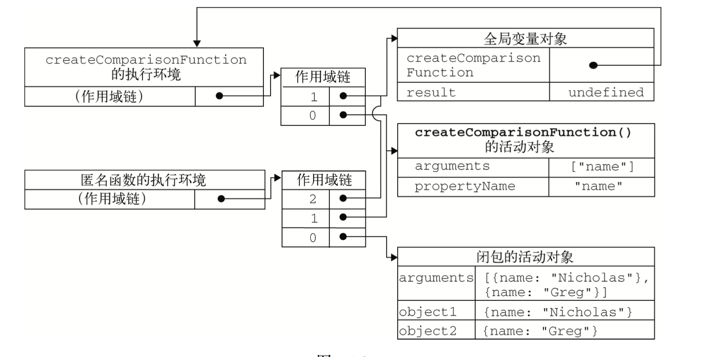

#函数表达式
##递归
简单来说就是函数内部调用函数

```
function factorial(num) {
    if (num <= 1) {
        return 1;
    } else {
        return num * factorial(num - 1);
    }
}
```

##闭包
有权访问另外一个函数作用域中变量的函数。常见的就是在一个函数内部创建另外一个函数。

```

function createComparisonFunction(propertyName) {
    return function(object1, object2) {
        var value1 = object1[propertyName];
        var value2 = object2[propertyName];
        if (value1 < value2) {
            return -1;
        } else if (value1 > value2) {
            return 1;
        } else {
            return 0;
        }
    };
}

var compare = createComparisonFunction("name");

console.log(compare({name:'dong'},{name:'ting'}));//-1
```
在第三第四行里面的propertyName，访问了外部函数的变量propertyName




##闭包与变量

```
function createFunctions(){
    var result = new Array();
    for (var  i=0;i<10;i++) {
        result[i]
    }
}
```